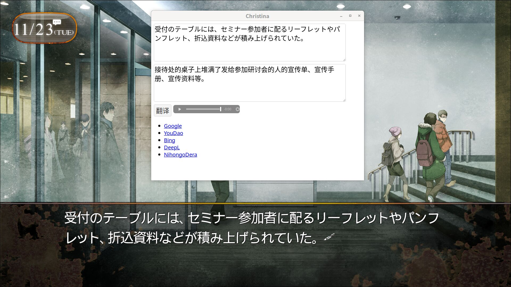

# Christina

An assistant to help play with [STEINS;GATE](https://store.steampowered.com/app/412830/STEINSGATE/).

Take a screenshot then get the Japanese text and translate.



## Build

Powered by <https://www.rust-lang.org> and <https://tauri.app>.

Depends on [tesseract](https://github.com/tesseract-ocr/tesseract).

Refactored to use [wry](https://github.com/tauri-apps/wry) directly.

```bash
cargo build
```

## Usage

Set a global shortcut, start game and run.

This tool will keep a system tray when close. Use system tray to quit.

If it's already running when start, contents will reload.
So just input shortcut when you want to use it.


